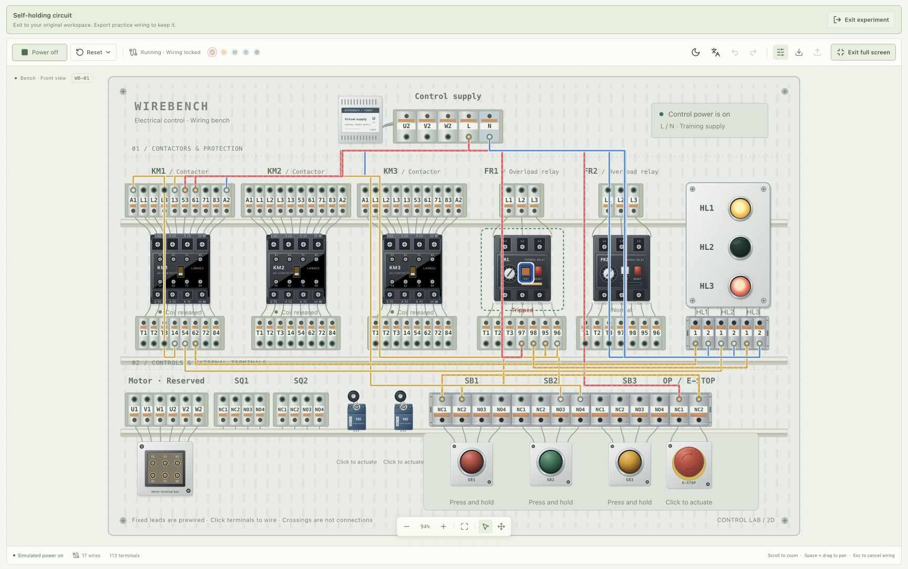

# WireBench 2D

[简体中文](README.md) · English

A two-dimensional electrical training bench in your browser. Device leads are already connected to terminal strips. Draw wires between terminals, operate buttons and switches, and watch contactors and indicator lamps respond to the circuit you build.

**First open-source teaching preview: [v0.1.0-alpha](https://github.com/EthanSky2986/WireBench-2D/releases/tag/v0.1.0-alpha).** Code uses the MIT license; the public repository excludes original reference images. The current model supports basic control-circuit practice; it does not calculate physical voltage, current, or motor motion.



## Features

- 16 device definitions and 113 selectable terminals; refined artwork throughout the main bench and device inspector.
- Three editable examples: button-controlled lamp, contactor jogging, and self-holding start/stop. An empty workspace supports independent wiring.
- Wire drawing, selection, colors, draggable bends, deletion, undo, and redo. Cycle overlapping wires; a selected wire pulses slowly and marks its endpoints.
- Short-circuit and unstable-circuit messages, overload relay tests, emergency stop, and normally open/closed contact behavior.
- Complete Simplified Chinese and English interfaces, light/dark themes, collapsible navigation, zoom, pan, and full screen.
- Browser-local autosave for your own workspace, validated JSON import, file export, and protection against overwriting damaged saved projects.

No account or backend is required. Installing dependencies needs internet access; core experiments use local resources afterward.

## Run locally

Install Node.js **22.12+** and npm; Node.js **24 LTS** is recommended. In the project directory:

```sh
npm ci
npm run dev
```

Open the address printed in the terminal, normally [http://127.0.0.1:5173/](http://127.0.0.1:5173/). Keep the terminal open while using the application; press Control+C to stop it.

On macOS, you can also double-click **启动实验台.command**. If macOS does not run it directly, right-click and choose Open, or run `zsh 启动实验台.command` in a terminal. The launcher also requires Node.js and npm.

## Your first experiment

1. Use the language icon to select **English**. Expand navigation and select **Self-holding circuit**.
2. Select **Power on**. The amber lamp indicates standby.
3. Press and release **SB2**: **KM1** energizes and holds; the green lamp stays on.
4. Press **SB1** to stop, or click **E-STOP** to latch the emergency stop. Click it again to reset; resetting alone does not restart the circuit.
5. Start again, then click **FR1’s TEST** to test a trip: the contactor releases and the red lamp lights. Click **RESET** to reset it; clicking the relay body only shows its details.
6. Select **Exit experiment** to restore the workspace you had before entering the example.

Examples contain ordinary wire data rather than preset simulation results. Turn off power, remove a necessary wire, and power on again: the result changes with the actual circuit.

## Controls

| Action                     | How                                                                                                                                                              |
| -------------------------- | ---------------------------------------------------------------------------------------------------------------------------------------------------------------- |
| Draw a wire                | With power off, click the starting and destination terminals; click empty space, an existing wire, or a device body along the way to add bends                   |
| Cancel a pending wire      | Press Esc or use the cancel control                                                                                                                              |
| Adjust routing             | Select a wire and drag its circular bend handles                                                                                                                 |
| Identify overlapping wires | Click the same position repeatedly or select **Next wire**; the selected wire moves visually to the front and marks its endpoints while other ordinary wires dim |
| Change color / delete      | Select a wire and use the inspector; Delete also removes it                                                                                                      |
| Undo / redo                | Toolbar, ⌘/Ctrl+Z, or ⌘/Ctrl+Shift+Z                                                                                                                             |
| Zoom / pan                 | Scroll to zoom; hold Space and drag, use the middle mouse button, or select the pan tool; **Fit bench to view** restores automatic fitting                       |
| Momentary pushbutton       | Hold to activate and release to reset; focused buttons also support Space/Enter                                                                                  |
| SQ, emergency stop         | Click to activate, click again to reset                                                                                                                          |
| FR overload relay          | Body opens details; TEST trips, RESET resets. Current adjustment is not simulated.                                                                               |
| Reset operating state      | **Reset → Reset operating state** beside power; powers off and resets inputs and faults, retaining wiring and history                                            |
| Clear wiring               | **Reset → Clear all wiring**, then confirm; keeps the name and current exercise and can be undone                                                                |
| Exit an example            | Select **Exit experiment**, click the selected example again, or choose **My workspace**                                                                         |
| Save / import / export     | Your own workspace autosaves; export from the toolbar or import a `.wirebench.json` file with power off                                                          |
| Language / theme           | Language icon opens a menu; appearance icon switches theme directly; both move to the toolbar in full screen                                                     |
| Full screen / navigation   | Enter full screen from the toolbar; Esc or the exit control restores it; navigation and its groups can collapse independently                                    |

Full screen preserves the circuit and running state. If native full screen is unavailable, the bench fills the page and displays a notice. The system's reduced-motion preference disables wire pulsing while retaining static selection marks.

Wire crossings, overlaps, and routes passing over terminals do not connect them: only each wire's endpoints create an electrical connection. Color, route, and fixed-lead visibility do not affect simulation.

## Saving and recovery

**Your own workspace** saves its name and wires in local storage for the current browser and address; there is no cloud sync. Language and theme preferences are separate from project files. Undo/redo history does not survive a refresh.

**Examples are temporary exercises.** Entering one preserves your original workspace and history; exiting restores them. Switching examples starts from the new template. Exit or refresh discards practice changes, so export to keep them; the Save icon also exports in an example. Refresh returns to your saved personal workspace.

Successful import replaces your own workspace and exits any example. Undo can restore the previous wires; the name is not part of wiring history. Failed import preserves the current project. Damaged or unknown-version saved data is protected from overwrite; see [Architecture](docs/ARCHITECTURE.md#外部数据与版本) for recovery instructions.

Export is implemented, but the full download-to-disk and reimport workflow has not yet been verified in the user's Chrome browser. Check the browser's downloads and the actual file; the interface only reports that a download was requested. See the [verification record](docs/VERIFICATION.md).

## Model scope and known limitations

Devices include KM1–KM3 with LANN22 auxiliary contacts, FR1–FR2, SQ1–SQ2, SB1–SB3, an emergency stop, HL1–HL3, a teaching supply, and a reserved motor terminal area.

| Supported                                                                                                 | Not simulated or not yet verified                                                                                   |
| --------------------------------------------------------------------------------------------------------- | ------------------------------------------------------------------------------------------------------------------- |
| Ideal normally open/closed contacts, jogging, self-holding, stop circuits, and independent parallel loads | Physical voltage, current, coil ratings, frequency, and pickup thresholds                                           |
| Emergency stop when wired into a circuit; FR tests switch auxiliary contacts                              | Three-phase power and motor motion, voltage division across series loads, temperature rise, and thermal trip timing |
| Explicit short-circuit, unstable-circuit, and unsupported-arrangement messages                            | Real terminal wire capacity and engineering validation of physical wiring                                           |
| Core desktop-browser interactions tested locally                                                          | Full cross-browser coverage, touch/mobile use, and performance with 500 wires                                       |

`POWER:L/N` represents logical supply rails. An FR test does not directly open its three-phase through paths; the emergency stop is not a global power switch. Unsupported arrangements produce a message; simulation results do not establish that physical wiring is safe.

Refined devices are in the main bench. **Rounded wires remain exclusive to the material study.** Open it through the sidebar or `/?preview=materials` after starting the app. The study runs independently without reading or writing your workspace. Main-bench routes do not yet separate lanes or avoid collisions automatically; see the [visual guidelines](docs/VISUAL_STYLE.md).

## Development and feedback

```sh
npm run check        # Format check, TypeScript/build, and all tests
npm run format       # Apply the shared code format
npm run preview      # Preview the existing production build; use the printed address
```

Reports should include the browser, reproduction steps, expected behavior, and actual behavior. Attach a `.wirebench.json` with personal information removed if needed. Please use [Issues](https://github.com/EthanSky2986/WireBench-2D/issues).

- [Contributing](CONTRIBUTING.md)
- [Quality improvement plan](docs/QUALITY_PLAN.md)
- [Changelog](CHANGELOG.md) · [Roadmap](ROADMAP.md)
- [Architecture](docs/ARCHITECTURE.md) · [Detailed development conventions](docs/CONTRIBUTING.md) · [Internationalization](docs/INTERNATIONALIZATION.md)
- [Verification record](docs/VERIFICATION.md) · [Open-source readiness](docs/OPEN_SOURCE_READINESS.md) · [Project constraints](AGENTS.md)

Detailed architecture and verification documents are currently in Chinese. The contribution guide, roadmap, and changelog provide English summaries.

## Repository and licensing status

The [GitHub repository](https://github.com/EthanSky2986/WireBench-2D) is open source as the `v0.1.0-alpha` teaching preview. Project code and original documentation use the [MIT license](LICENSE). User-supplied photographs, sketches, product images, and their copies are excluded. README screenshots show the application itself; the terminal-layout reference is generated from code. See [third-party and reference-material notices](THIRD_PARTY_NOTICES.md) for dependency and material scope.

The public repository starts with checked, fresh history and contains no old commits. The original repository remains a private backup. An independent student/teacher trial and a real file-download/reimport round trip remain unverified; see the [release checks](docs/OPEN_SOURCE_READINESS.md).

`private: true` in `package.json` prevents accidental npm publication; it does not control GitHub visibility. Sharing source on GitHub does not require publishing an npm package.
