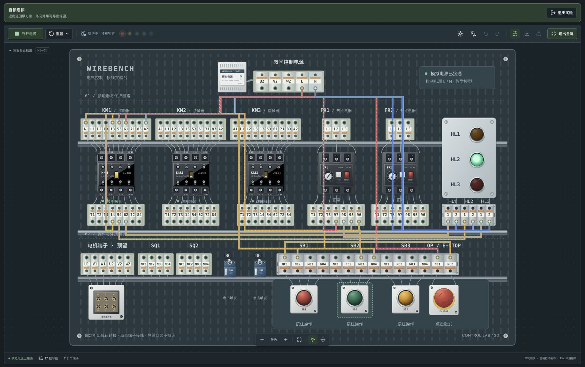

# WireBench 2D

简体中文 · [English](README.en.md)

在浏览器里练习电气接线的二维教学实验台。器件到端子排的引出线已经预接，学生在端子之间自由接线，再操作按钮、开关，观察接触器与指示灯按实际连接关系动作。

**首个开源教学预览版：[v0.1.0-alpha](https://github.com/EthanSky2986/WireBench-2D/releases/tag/v0.1.0-alpha)。** 代码采用 MIT 许可证，公开仓库不包含原始参考图片。当前适合基础控制回路练习；它不是计算真实电压、电流或电机运动的电路求解器。



## 已有功能

- 16 个器件定义、113 个可选端子；正式画布和器件详情均使用新版外观。三盏指示灯共用竖向面板，下方为六位端子排；SB 各组端子与按钮上下对齐。
- 按钮点灯、接触器点动、自锁启停三个可编辑示例；可从空白工作区自由接线。
- 绘制、选中、改色、拖动拐点、删除导线，支持撤销/重做。重叠线可轮换选择，选中线缓慢闪烁并标亮两端。
- 短路与不稳定回路提示，FR 测试、急停和常开/常闭触点联动。
- 完整中英文界面、明暗主题、折叠侧栏、缩放平移和实验台全屏。
- 自主稿在本机浏览器自动保存；支持校验后的 JSON 导入、文件导出与损坏存档保护。

无需账号或后端服务。首次安装依赖需要网络，之后核心实验使用本机资源。

## 启动

需要 Node.js **22.12+** 和 npm，推荐 Node.js **24 LTS**。在项目目录执行：

```sh
npm ci
npm run dev
```

在浏览器打开终端显示的地址，通常为 [http://127.0.0.1:5173/](http://127.0.0.1:5173/)。使用期间保留终端窗口，按 Control+C 停止服务。

macOS 也可以双击 **启动实验台.command**。若系统未直接执行，右键选择“打开”，或在终端执行 `zsh 启动实验台.command`。脚本同样需要已安装的 Node.js 和 npm。

## 第一次实验

1. 展开左侧导航，选择 **自锁启停**。
2. 点击 **接通电源**，黄色灯显示待机。
3. 按下再松开 **SB2**：**KM1** 吸合并自锁，绿色灯继续亮。
4. 按 **SB1** 停止，或点击 **E-STOP** 锁定急停。再次点击急停复位，不会自动重新启动。
5. 再次启动，点击 **FR1 的 TEST** 测试跳闸：接触器释放，红色灯亮。点击 **RESET** 复位；点击器件本体只查看详情。
6. 点击 **退出实验**，返回进入示例前的自主接线工作区。

示例使用普通接线数据，不按实验名称预设结果。断电后拆去关键导线，再通电观察，结果会随实际接线改变。

## 常用操作

| 操作             | 方法                                                                           |
| ---------------- | ------------------------------------------------------------------------------ |
| 接线             | 断电后点击起点端子、再点击终点；途中点空白处、已有导线或器件本体添加拐点       |
| 取消正在绘制的线 | Esc 或接线提示中的取消按钮                                                     |
| 修改路径         | 选中导线，拖动圆形拐点                                                         |
| 辨认重叠线       | 在同一位置重复点击，或点击「下一根」；选中线置顶、两端标亮，其他普通线适度淡化 |
| 改色 / 删除      | 选中导线，在右侧详情操作；Delete 也可删除                                      |
| 撤销 / 重做      | 工具栏，或 ⌘/Ctrl+Z、⌘/Ctrl+Shift+Z                                            |
| 缩放 / 平移      | 滚轮缩放；空格拖动、中键拖动或平移工具；「适应画布」恢复自动适配               |
| 瞬时按钮         | 按住动作、松开恢复；键盘聚焦后按 Space/Enter                                   |
| SQ、急停         | 点击动作，再次点击复位                                                         |
| FR 热继电器      | 本体只查看；TEST 测试跳闸，RESET 手动复位。旋钮暂不参与仿真                    |
| 复位运行状态     | 电源旁「重置」→「复位运行状态」；断电并复位输入与故障，保留接线和历史          |
| 清空接线         | 「重置」→「清空全部接线」，确认后清空；保留名称和当前练习，可撤销恢复          |
| 退出示例         | 「退出实验」、再次点击当前示例，或点击「自主接线」                             |
| 保存 / 导入导出  | 自主稿自动保存；工具栏可导出，断电时可导入 `.wirebench.json` 文件              |
| 语言 / 主题      | 语言图标打开中英文菜单；外观图标直接切换明暗，全屏时均移至工具栏               |
| 全屏 / 侧栏      | 工具栏进入全屏，Esc 或退出按钮恢复；侧栏与左侧分组可独立展开/收起              |

全屏保留当前接线与运行状态。浏览器拒绝原生全屏时会提示，并改为页面内铺满。减少动态效果的系统偏好会关闭导线闪烁，保留静态选中标记。

导线交叉、重叠或经过其他端子不会自动相连；只有导线的两个端点建立电气连接。导线颜色、路径和固定引出线的显示方式不影响仿真。

## 保存与恢复

**自主稿**的名称与接线保存在当前浏览器、当前网址的本地存储中；没有云端同步。语言与主题独立保存，不进入接线文件。撤销/重做历史不跨刷新保存。

**示例练习是临时的。** 进入示例保留原自主稿及历史；退出时恢复原稿。切换示例从新模板开始，退出或刷新会丢弃练习修改，需要保留时请导出；示例中的保存图标也执行导出。刷新后回到已保存的自主稿。

导入成功后替换自主稿并退出示例；原有线路可通过撤销恢复，名称不属于接线历史。导入失败保留当前方案。损坏或未知版本的本地存档不会被自动保存覆盖，恢复步骤见[架构说明](docs/ARCHITECTURE.md#外部数据与版本)。

文件导出已实现，但本机 Chrome 中“下载落盘后再次导入”的完整验收尚未完成。以浏览器下载列表和实际文件为准，界面只提示已请求下载；当前验证记录见[验收记录](docs/VERIFICATION.md)。

## 仿真范围与已知限制

器件包括 KM1–KM3 及 LANN22 辅助触点、FR1–FR2、SQ1–SQ2、SB1–SB3、急停、HL1–HL3，以及教学电源和预留电机接线区。

| 已支持                                            | 尚未模拟或验证                                          |
| ------------------------------------------------- | ------------------------------------------------------- |
| 理想常开/常闭触点、点动、自锁、停止及独立并联负载 | 真实电压、电流、线圈额定值、频率与吸合阈值              |
| 接入回路内的急停；FR 测试切换辅助触点             | 三相电源和电机运动、串联负载分压、温升及热保护延时      |
| 短路定位、不稳定回路和不支持接法的明确提示        | 实物端子孔可容纳的导线数量及工程接线安全验证            |
| 本机桌面浏览器的核心交互验收                      | 完整跨浏览器兼容性、移动触控体验和 500 根线时的性能验收 |

`POWER:L/N` 仅表示逻辑供电；FR 测试不会直接断开三相主通路，急停也不是全局电源开关。不支持的接法会提示，不能据此推断实物接线的安全性。

新版器件已用于正式实验台；**圆弯导线仍仅在视觉小样中**。启动后可通过侧栏「视觉小样」或 `/?preview=materials` 查看新旧对比，小样独立运行，不读写自主稿。正式接线路径尚不自动避让或分道，见[视觉规范](docs/VISUAL_STYLE.md)。

## 开发与反馈

```sh
npm run check        # 格式检查、TypeScript/构建、全部逻辑测试
npm run format       # 统一代码格式
npm run preview      # 预览已构建结果，地址以终端输出为准
```

反馈问题时请提供浏览器、复现步骤、预期与实际结果，必要时附脱敏后的 `.wirebench.json`。可通过 [Issues](https://github.com/EthanSky2986/WireBench-2D/issues) 提交。

- [贡献指南 / Contributing](CONTRIBUTING.md)
- [质量改进计划](docs/QUALITY_PLAN.md)
- [变更记录 / Changelog](CHANGELOG.md) · [路线图 / Roadmap](ROADMAP.md)
- [架构说明](docs/ARCHITECTURE.md) · [详细开发约定](docs/CONTRIBUTING.md) · [国际化约定](docs/INTERNATIONALIZATION.md)
- [验收记录](docs/VERIFICATION.md) · [开源准备清单](docs/OPEN_SOURCE_READINESS.md) · [项目约束](AGENTS.md)

## 仓库与许可状态

[GitHub 仓库](https://github.com/EthanSky2986/WireBench-2D) 以 `v0.1.0-alpha` 教学预览版开源。项目代码与原创文档采用 [MIT 许可证](LICENSE)。公开版本不分发用户提供的实物照片、手绘资料、产品图片及其副本；README 截图来自项目自身界面，端子布局参考图通过代码绘制。依赖与资料范围见[第三方与参考资料说明](THIRD_PARTY_NOTICES.md)。

公开仓库使用经过检查的全新历史，不包含旧提交；含原始资料的旧仓库继续作为私有备份。独立教师或学生试用、真实文件下载与重新导入的完整验收仍待完成，详见[发布检查记录](docs/OPEN_SOURCE_READINESS.md)。

`package.json` 中的 `private: true` 只防止误发布到 npm，不控制 GitHub 仓库可见性。公开源码不要求发布 npm 包。
