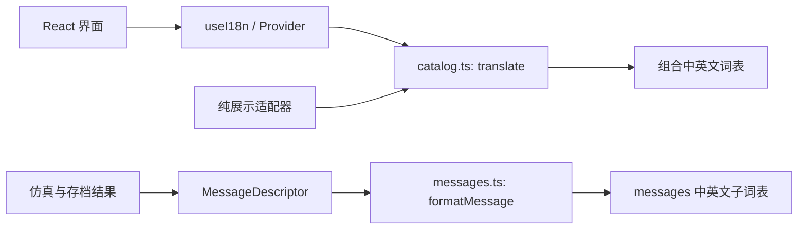

# 中英文国际化

界面提供简体中文和英文，语言值为 `zh-CN` / `en`。默认中文；用户选择后立即切换界面，并保存到独立的浏览器语言偏好。语言切换不重新接线、不重置仿真，也不修改用户保存的方案名称和端子 ID。

## 词表结构与类型约束

| 文件                                         | 范围                                               |
| -------------------------------------------- | -------------------------------------------------- |
| `src/i18n/ui.zh.ts` / `ui.en.ts`             | 页头、侧栏、示例说明、工具栏、弹窗、操作记录与提示 |
| `src/i18n/bench.zh.ts` / `bench.en.ts`       | 实验台、器件名称、详情面板、颜色与可访问性标签     |
| `src/i18n/learning.zh.ts` / `learning.en.ts` | 分步观察、动作快照、供电通路及前后差异说明         |
| `src/i18n/messages.zh.ts` / `messages.en.ts` | 仿真故障、存档校验和存储错误等结构化消息           |
| `src/i18n/zh-CN.ts` / `en.ts`                | 组合以上子词表及基础语言名称                       |
| `src/i18n/catalog.ts`                        | 语言类型、翻译键、纯 `translate` 与字符串插值      |
| `src/i18n/provider.tsx`                      | React 上下文、语言偏好及页面 `lang` 属性           |
| `src/i18n/messages.ts`                       | 结构化消息描述与纯文本格式化适配器                 |

每个中文子词表 `export const zh = { ... } as const`，英文 `export const en = { ... } satisfies Record<keyof typeof zh, string>`。中文键集合是类型来源，英文不能缺键或额外添加无对应条目。合并后的 `TranslationKey` 同样由中文推导，调用 `t` 时检查键名。

键按用途分组，例如 `ui.action.save`、`bench.powerOn`、`inspector.contacts`、`message.error.unknown`。子词表之间不能复用同一个键，避免对象展开时后者覆盖前者。键名应表达含义，避免将整段中文作为键。

插值使用 `{name}`。中英文可以调整语序，但参数名称须一致；传入值为字符串或数字。纯翻译函数不会把插值内容解释成 HTML，界面也不应使用 `dangerouslySetInnerHTML` 渲染翻译。

## React 与纯函数的边界

在应用入口包裹 `I18nProvider`，组件从公共入口取翻译：

```tsx
import { useI18n } from './i18n';

const { locale, setLocale, t } = useI18n();
const caption = t('ui.footer.terminals', { count: 113 });
setLocale(locale === 'zh-CN' ? 'en' : 'zh-CN');
```

非 React 展示适配器直接导入纯入口，不经过 Provider 的导出入口：

```ts
import { translate, type Locale } from './i18n/catalog';

function terminalCaption(locale: Locale, count: number) {
  return translate(locale, 'ui.footer.terminals', { count });
}
```



`catalog.ts` 和 `messages.ts` 不导入 React。领域结果携带代码和参数，不为语言切换重新运行仿真。文字变化与线圈、触点的电气计算保持独立。

## 错误、故障和操作记录

`MessageDescriptor` 使用 `{ code, params? }`，参数可以包含数字、原始字符串、字符串数组及嵌套消息描述。`formatMessage(descriptor, locale)` 按当前语言格式化；`localizeFault`、`localizeProjectError`、`localizeStorageError` 为现有结果提供展示适配。

项目自己生成的消息优先保存描述对象，渲染时再翻译。只保存已翻译字符串会使历史记录停留在旧语言。现有中文 `message` / `error` 字段用于兼容；不要通过匹配中文句子猜测消息类型。浏览器或外部文件提供的原始错误细节可以原样保留，不能伪造翻译后的原因。

分步观察快照保存 `ObservationAction`、器件 ID、布尔状态和结果，不保存翻译后的动作名称。`ObservationPanel` 的 `formatObservationAction` 按操作类型、器件种类和当前语言格式化按下、松开、FR 测试、复位及系统释放原因；历史快照在切换语言后即时更新文字，输入和线圈状态保持不变。

`learning.*` 同时覆盖普通视图与全屏中的观察入口、历史只读提示、步骤选择、观察负载、供电状态、触点清单和前后差异。供电解释使用「连接到 L/N」「可能的供电与回线」等准确措辞，不将理想开关模型翻译成实测电流、额定电压或真实动作时间。触点 ID 和导线端点作为原始电气标识插值，仍不翻译或重命名。

## 语言与项目数据隔离

- `wirebench-2d.locale` 只保存语言偏好，`wirebench-2d.project.v1` 只保存接线方案，二者不互相覆盖。
- 语言偏好访问失败时回退中文或维持当前内存中的选择，不影响实验和项目存档。页面的 `document.documentElement.lang` 随语言同步。
- 用户方案名称、用户导入文字、器件 ID、端子标签及接线文件格式保持原值。更换语言不会将已经保存的“自锁启停”改写成英文名称。
- 器件描述、示例说明和系统生成的提示可以翻译；`KM1:A1`、`POWER:L`、`13–14` 等电气标识始终不变。
- 原始手绘图与实物照片是参考资料，图内原文不做自动替换。

## 添加或修改翻译

1. 在所属中文子词表添加语义明确的新键，同步英文，并保持插值参数一致。
2. 普通界面使用 `t`；错误或仿真结果添加结构化消息描述，不在纯模型中读取浏览器语言。
3. 同步可见文字、工具提示、按钮的 `aria-label`、弹窗说明及空状态，避免只翻译大标题。
4. 运行 `npm test -- src/i18n/catalog.test.ts`，检查键集合、非空值、插值及跨词表重复键；完成类型检查和构建。
5. 在浏览器切换两种语言，检查长英文在工具栏、侧栏、详情和全屏内的换行，以及故障和已有操作记录是否随语言变化。

新增第三种语言时，增加对应的子词表和组合入口，扩展 `Locale`、`SUPPORTED_LOCALES`、`isLocale`、`catalogs`，以及独立消息适配器中的语言类型和词表选择。将当前两种语言的一键切换改为适合多语言的选择器，并补齐页面 `lang` 值和契约测试覆盖。不要为语言扩展更改接线存档版本或端子 ID。
